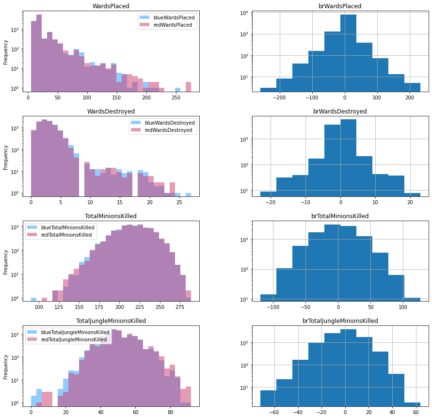
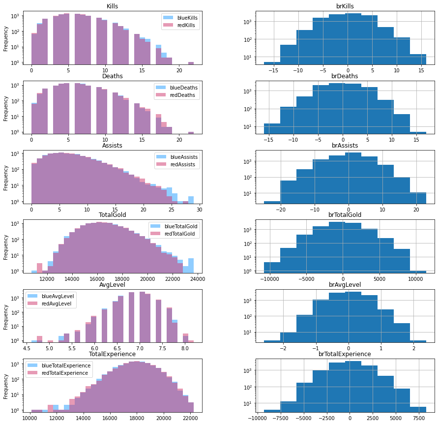

# 第一次实验报告

## 一、实验目标

​		本实验以 Kaggle 的相关数据集为基础，依据 LOL 游戏中 9879 场单双排对局前 10 分钟特征信息，采用决策树算法预测最后获胜方。所提供的信息包括击杀数、任务完成数、存在防御塔数、经济数等，大部分为可连续取值的变量或取值数较多的整型变量。

​		本实验报告中所有代码均为示例代码，为了叙述清晰，部分是从函数、类中粘贴出来，不保证单独可以正确执行。欲运行程序，请运行 `hw1.py`。作者所使用的环境是 MacOS 12.2.1，Python 3.9，PyCharm 2021.3.1，能正确运行该脚本。

## 二、数据描述与处理

​		首先导入数据：

```python
from collections import Counter
import pandas as pd  # 数据处理
import numpy as np  # 数学运算
from sklearn.model_selection import train_test_split, cross_validate  # 划分数据集函数
from sklearn.metrics import accuracy_score  # 准确率函数

csv_data = './high_diamond_ranked_10min.csv'  # 数据路径
data_df = pd.read_csv(csv_data, sep=',')  # 读入csv文件为pandas的DataFrame
data_df = data_df.drop(columns='gameId')  # 舍去对局标号列
```

进行一些初步的处理，包括舍去可以计算的信息、计算差值等：

```python
# (1) 舍去多余的信息
df = data_df.drop(columns=drop_features)  # 舍去特征列
# (2) 创建差值列
info_names = [c[3:] for c in data_df.columns if c.startswith('red')]  # blue 多一个 blueWins
for info in info_names:
    data_df['br' + info] = data_df['blue' + info] - data_df['red' + info]  # 构造由蓝色特征减去红色特征，前缀为br
df = df.drop(columns=['blueFirstBlood', 'redFirstBlood'])  # FirstBlood 为首次击杀最多有一只队伍能获得
```

进行初步处理后，可以用描述统计和图标看看数据的形式，增加对数据的了解。

### 2.1 查看统计特征

```python
data_df.describe()
```

​		虽然但是，没什么用处。

### 2.2 查看取值情况

​		采用以下代码输出每列的取值种类，以及相应频度：

```python
# 显示各特征的取值特点
for c in df:
    print(df[c].value_counts())
```

样例输出如下：

```
0    4949
1    4930
Name: blueWins, dtype: int64
16     1255
15     1217
17      988
14      974
18      831
       ... 
165       1
120       1
148       1
111       1
137       1
Name: blueWardsPlaced, Length: 147, dtype: int64
```

依据此输出得知哪些部分数据是离散的，哪些部分数据是连续的，便于后续处理。

### 2.3 查看分布情况

​		为了查看取值的分布情况，采用以下代码绘制分布图，空间所限仅展示部分代码，大部分代码逻辑相同。

```python
import matplotlib.pyplot as plt
fig, axs = plt.subplots(4, 2, figsize=(15,15))
df[['blueWardsPlaced', 'redWardsPlaced']].plot.hist(ax=axs[0,0], bins=30, 
                                                    color=['#239CFF', '#CF366C'], 
                                                    log=True, alpha=0.5)
df[['blueWardsDestroyed', 'redWardsDestroyed']].plot.hist(ax=axs[1,0], bins=30, 
                                                          color=['#239CFF', '#CF366C'], 
                                                          log=True, alpha=0.5)
df[['blueTotalMinionsKilled', 'redTotalMinionsKilled']].plot.hist(ax=axs[2,0], bins=30, 
                                                                  color=['#239CFF', '#CF366C'], 
                                                                  log=True, alpha=0.5)
df[['blueTotalJungleMinionsKilled', 'redTotalJungleMinionsKilled',]].plot.hist(ax=axs[3,0], bins=30, 
                                                                               color=['#239CFF', '#CF366C'], 
                                                                               log=True, alpha=0.5)
axs[0, 0].set_title("WardsPlaced")
axs[1, 0].set_title("WardsDestroyed")
axs[2, 0].set_title("TotalMinionsKilled")
axs[3, 0].set_title("TotalJungleMinionsKilled")

df.hist(ax=axs[0,1], log=True, column=['brWardsPlaced'])
df.hist(ax=axs[1,1], log=True, column=['brWardsDestroyed'])
df.hist(ax=axs[2,1], log=True, column=['brTotalMinionsKilled'])
df.hist(ax=axs[3,1], log=True, column=['brTotalJungleMinionsKilled'])

plt.show()
```

得到的图像如下所示，纵坐标均采用对数坐标。





大部分分布，尤其是差值变量 br... 的分布符合单峰特点，这为如何选取划分特征的分位点提供了指导。

### 2.4 特征的离散化

​		首先按照 2.2 节的观察选取各特征的处理方式

```python
discrete_features = ['blueWins',  # {0, 1}
                     'brFirstBlood',  # {-1, 1}
                     'blueEliteMonsters', 'redEliteMonsters', 'brEliteMonsters',  # {0, 1, 2}
                     'blueDragons', 'redDragons', 'brDragons',  # {0, 1}
                     'blueHeralds', 'redHeralds', 'brHeralds',  # {0, 1}
                     'blueTowersDestroyed', 'redTowersDestroyed', 'brTowersDestroyed',  # {0, 1, 2, 3, 4}
                     ]  # 具有少数几个可能取值的特征, 可以直接使用
q_features = ['blueWardsPlaced', 'redWardsPlaced', 'brWardsPlaced',
              'blueWardsDestroyed', 'redWardsDestroyed', 'brWardsDestroyed',
              'blueTotalMinionsKilled', 'redTotalMinionsKilled', 'brTotalMinionsKilled',
              'blueTotalJungleMinionsKilled', 'redTotalJungleMinionsKilled', 'brTotalJungleMinionsKilled',
              'blueKills', 'redKills', 'brKills',
              'blueDeaths', 'redDeaths', 'brDeaths',
              'blueAssists', 'redAssists', 'brAssists',
              'blueTotalGold', 'redTotalGold', 'brTotalGold',
              'blueAvgLevel', 'redAvgLevel', 'brAvgLevel',
              'blueTotalExperience', 'redTotalExperience', 'brTotalExperience',
              ]  # 连续分布的特征, 考虑采用分位数离散化
QUANTILES = [.05, .25, .5, .75, .95]  # 分位点
```

这部分内容可以放入一个单独的文件 `config.py` 中，便于修改。离散化的过程如下所示：

```python
discrete_df = df.copy()  # 先复制一份数据
for c in df.columns[1:]:  # 遍历每一列特征，跳过标签列
    if c in discrete_features:
        continue
    if c in q_features:
        col = df[c]
        BIN_BOUND = [np.NINF]  # 区间起点 (防止分 bin 后出现 NaN)
        for qnt in QUANTILES:  # 读取 config 中选定的分位数
            BIN_BOUND.append(col.quantile(qnt))
        BIN_BOUND.append(np.inf)  # 区间终点
        BIN = pd.IntervalIndex.from_tuples([(BIN_BOUND[i], BIN_BOUND[i+1]) for i in range(0, 6)])
        discrete_df[c] = pd.cut(col, BIN)  # 相比 qcut 这样做的好处是分位点比较整, 且不会出现分位点不唯一的情况.
    # 对某些维度可能会有更好的预处理方式，先专注于用分位数离散化
```

这里有几点值得一提的细节：

- 分位点的起点和终点分别设置为 $-\infty$ 和 $\infty$，是为了防止划分区间后出现 NaN。理论上只有左端点会出现 NaN，但是作者尝试了设置为 `col.min()`, `col.min()-1` 均仍有 NaN 出现。设置 `include_lowest=True` 后，还有出现 `(col.min(), col.min()]` 频度为 0 的情况，且依然有 NaN。只有设为无穷才解决该问题。

- 分位完成后，应当检查下分类结果是否正确。但是，`discrete_df.value_counts()` 不会显示 NaN 的存在，只能从相加数目上判断。可以使用

  ```python
  discrete_df.isnull().values.any()
  ```

  查看是否有 NaN 存在，如果有，还可以使用

  ```python
  discrete_df.isnull().sum()
  ```

  来看每一列中有几个 NaN。必须要解决 NaN 问题，因为它是个 float，如果存在，划分的区间 Interval 类型和它不可比，会导致部分方法无法使用。

- 我没有选择使用 `pd.qcut()`，是因为它为了解决分位点不唯一的情况，切出来的大部分都是小数点后很多位的浮点数，影响观感。使用上述过程构造 BIN 并切分区间使得分位结果比较美观。

### 2.5 划分训练集与测试集

```python
# (1) 提取标签和特征
all_y = discrete_df['blueWins'].values  # 所有标签数据
feature_names = discrete_df.columns[1:]  # 所有特征的名称
all_x = discrete_df[feature_names].values  # 所有原始特征值，pandas 的 DataFrame.values 取出为 numpy 的 array 矩阵
# (2) 划分训练集和测试集
x_train, x_test, y_train, y_test = train_test_split(all_x, all_y, test_size=0.2, random_state=RANDOM_SEED)
```

## 三、决策树模型的设计

### 3.1 模型的属性设计

```python
def __init__(self, classes: list, features: list,
					    max_depth=10, min_samples_split=10, min_info_gain=0.05,
							impurity_t='entropy'):
    """
    Set up the details of the problem.

    :param classes: a list containing names for all classes.
    :param features: a list containing names of all features.
    :param max_depth: the maximum depth of decision tree.
    :param min_samples_split: the minimum number of instances in a node.
    :param impurity_t: the way to compute impurity.
    """

    self.classes = classes  # 模型的分类，如 [0, 1]
    self.feature_name = features  # 每个特征的名字
    self.max_depth = min(len(features), max_depth)  # 预剪枝：决策树时的最大深度
    self.min_samples_split =  min_samples_split  # 预剪枝：到达该节点的样本数小于该值则不再分裂
    self.min_info_gain = min_info_gain
    self.impurity_t = impurity_t  # 计算混杂度（不纯度）的计算方式，例如 entropy 或 gini
    self.root = None  # 定义根节点，未训练时为空
    self.data = None  # 缓存数据句柄
    self.label = None  # 缓存数据句柄
    self.feature_unique = []  # 每个属性的取值空间，与 features 相对应
    self.info_split = []  # 每个属性的 SplitInformation，与 features 相对应
    self.mask = [True for _ in range(0, len(features))]  # 记录哪些特征已经被选择, 这样 count 只需要算一遍
```

​		给模型设计以上属性的主要目的是用来缓存频繁用到的数据和中间结果，减少内部函数调用时无休止的传参。以上大部分属性的添加都是基于函数设计时的现实需求作出的，以下简要介绍各自的用途，待后续过程中再介绍细节。

- `self.classes` 存储模型的分类名称，`classes[i]` 是第 `i` 类的名称。在本例中模型类就是 0 和 1，因此这个设计的必要性不大，但是出于健壮性考虑保留这一设计。
- `self.feature_name` 存储输入特征的名称，`feature_name[i]` 是第 `i` 个特征的名称（字符串）。
- `self.max_depth` 存储参数 “树的最大深度”，用于预剪枝。这个最大深度不超过所有特征的数目，即保证每轮都有特征可选。
- `self.min_samples_split` 存储参数 “分裂样本数阈值”，用于预剪枝。
- `self.min_info_gain` 存储参数 “分裂信息增益阈值”，用于预剪枝。
- `self.impurity_t` 存储用户选择的信息熵计算方法，只能是 `'entropy'` 或 `'gini'`。
- `self.root` 存储建立好的决策树的根节点。
- `self.data` 和 `self.label` 分别存储训练数据特征和标签的句柄，因为是引用传参，在使用过程中不应该修改。
- `self.feature_unique` 是一个二维数组，`feature[_fea]` 是 `self.feature_name[_fea]` 这一特征可取值的全体。
- `self.info_split` 是一个一维数组，用于存储计算 Gain Ratio 的中间结果。
- `self.mask` 是一个一维数组，`mask[_fea]` 为真时表示此特征尚未被筛选，因此可以在这个节点选择。

### 3.2 辅助类型设计

​		为了便于记录节点的信息，设计了一个节点类型：

```python
class DTNode:

    def __init__(self, mode, branch, label=0, var=0, varname='', level=0):
        """
        A tree node for class DecisionTree.

        :param mode: 'node' or 'leaf'. 'root' is a 'node'.
        :param branch: feature_type.
        :param label: 'leaf' only, class of this leaf.
        :param var: feature.
        :param level:
        """
        self.branch = branch  # 来自上层节点的类别信息
        self._level = level
        if mode == 'leaf':
            self.end = True  # Leaf Node
            self.label = label
        else:
            self.variable = var  # 用于判断本层节点的变量序号
            self.varname = varname  # 用于判断本层节点的变量名称
            self.children = []  # 孩子节点的列表 [DTNode]
            self.end = False
```

如上述代码所示，共有两种节点，分别为叶子和非叶节点。二者使用 `self.end` 判别。对于叶子节点，用 `self.label` 记录当前节点的类别。对于非叶节点，用 `self.variable` 和 `self.varname` 分别记录当前节点分类所使用的特征，后者用于格式化输出；`self.children` 则包含该节点所有的孩子节点。

除了上述特征外，还有两个统一的特征，`self.branch` 记录上一节点通过哪个特征、哪个取值得到这个节点；`self._level` 记录当前节点层数。均用于格式化输出。

### 3.3 训练辅助函数设计

​		为了方便训练函数书写，设计一个计算熵的函数：约定用一个列表传入所有类的实例数目，作者自认为这种方式比较高效且方便。

```python
def impurity(self, mix, mode=None):
    """
    Calculate impurity by means which self.impurity_t specified.

    :param mix: [number of class_A instances, ...]
    :param mode: if to follow the self impurity
    :return: impurity value
    """
    total = sum(mix)
    if total == 0:
        return np.inf
    pars = [ele / total for ele in mix]  # 频率，用到 Python 3 特性

    if mode:
        im = mode
    else:
        im = self.impurity_t

    if im == 'entropy':
        ent = 0
        for par in pars:
            if par == 0:
                continue  # 约定 log2(0) = 0
            ent += par * log2(par)
        return -ent
    if im == 'gini':
        ent = 0
        for par in pars:
            ent += par * par
        return 1-ent
```

计算过程相当一目了然。因为后续算 Split Information 强制使用 entropy 方式，所以加了一个 mode 参数，不影响正常使用。没有再单独实现 gain 函数，因为传参麻烦。


### 3.4 模型训练

#### 3.4.1 预处理

​		训练函数设计如下：

```python
def fit(self, feature: np.ndarray, label: np.ndarray):
    """
    Train the model.

    :param feature: train set features, i.e., np.ndarray in shape (n, m), which each row represents a sample
    :param label: train set labels, i.e., np.ndarray in shape (n, ), represent each sample's class
    :return: nothing, use the object later.
    """
    # 判断输入合法性
    assert len(self.feature_name) == len(feature[0])  # 输入数据的特征数目应该和模型定义时的特征数目相同

    # 获取句柄
    self.data = feature
    self.label = label

    # 计算特征的取值数目
    for counter in range(0, self.data.shape[1]):
        self.feature_unique.append(list(np.unique(self.data[:, counter])))

    # 计算 SplitInformation (为了计算 GainRatio)
    count = []
    for _f_num in range(0, len(self.feature_name)):  # 初始化
        count.append([])  # count[^] 这个 index 表示特征维度
        for _fe_type in self.feature_unique[_f_num]:  # 该特征的每种取值
            count[_f_num].append(0)  # count[fea][^] 值为表示特征取该值的样本数目, 初始化为 0
    for spl_i in self.data:  # 数每个特征取值的个数
        for _f_num in range(0, len(self.feature_name)):  # 每个特征
            fea_type_i = self.feature_unique[_f_num].index(spl_i[_f_num])  # 找到对应特征类型的 offset
            count[_f_num][fea_type_i] += 1  # 类别为 type_i 的第 _f_num 项特征取 fea_type_i 的样本 +1
    for _fea in count:  # 计算 SI
        self.info_split.append(self.impurity(_fea, mode='entropy'))

    # 建树
    self.root = self.expand_node([True] * len(self.feature_name),  # 初始节点可选择所有的特征
                                 set(range(0, self.data.shape[0])))  # 同时保有所有的样本
```

这个函数主要做了以下两件事：

- 计算每个特征的取值数目，并将其存入 `self.feature_unique`。这一步的目的是为数据提供一个索引，使得我们可以把数据特征作为列表的下标来使用，具体来说，就是

  ```python
  fea_type_offset = self.feature_unique[_f_num].index(spl_i[_f_num])
  ```

- 计算每个特征的取值数目惩罚项，并将其存入 `self.info_split` 中。这一步的目的是之后计算 Gain Ratio 时可以不必重复求解其值，节省时间。计算过程也比较直观。

处理完这两样计算之后，它调用 `self.expand_node` 开始建树。

#### 3.4.2 建树算法的函数原型

​		我们采用以下原型设计：

```python
def expand_node(self, mask, sample, depth=0, impur=None, branch=('root', ''), p_mix=1):
    """
    Recursively build the decision tree.

    :param mask: a list of bool with same length of self.feature_name, True if the feature is not selected.
    :param sample: a set of index, in the set if the sample arrives this node.
    :param depth:
    :param impur: impurity for current node, only need to be calculated when root.
    :param branch: the feature selected last level, together with feature_type specified to build this branch
    :param p_mix: helps predict when no sample survive to leaf
    :return: Node handler
    """
```

这些都是递归的核心参数。

- `mask` 记载还未选择的特征，`sample` 记载分流到该节点的样本。这两个是最基本的控制信息。
- `impur` 记载该节点的混杂度，因为这是上一个节点选择特征时必须计算的，因此传递下来可以少计算一次。
- `branch` 记载了上一个节点分流到该节点所用的特征及取值，用于建树用。
- `p_mix` 是记录父节点中较多的一个类别，解决某些子节点无任何样本到达的分类问题（听父亲的）。

值得一提的是，前两个参数没法使用默认形参，因为它们分别和 `self.feature_names` 及 `self.data` 维度有关。这也是为什么之前调用它时写了两个生成式的原因。

#### 3.4.3 递归调用

​		我先写的递归调用，因为递归基需要建立叶子节点，而在调用过程中可能会修改节点的结构。递归调用部分如下：

```python
# 初始节点要计算当前混杂度: 只需要在初始节点计算！
if not impur:
    mix_root = [0] * len(self.classes)
    for sam in self.label:
        mix_root[self.classes.index(sam)] += 1
    impur = self.impurity(mix_root)
    
# 找到最佳分裂特征，递归调用 expand_node
# (1) 计算各特征的信息增益
fea_sieve = {}  # 用于存储 可选特征(index)：[gain, [每 _type 的起始 impurity(减少可能的计算)], [sample_i]]
for _fea in range(0, len(self.feature_name)):  # 每个特征
    if mask[_fea]:  # 若可供本节点筛选
        # a. 初始化容器
        mix_i = []  # 保存混杂度计算数据
        for i in range(0, len(self.feature_unique[_fea])):  # 循环赋值避免浅拷贝问题
            mix_i.append([0] * len(self.classes))  # mix_i[_type][_class] 为该特征分类下的某类实例数目
        sample_i = []  # 保存每个节点留下的样本编号
        for i in range(0, len(self.feature_unique[_fea])):  # 循环赋值避免浅拷贝问题
            sample_i.append(set())  # sample_i[_type] 为分流到该特征分类下子节点的所有样本
        # b. 查找，分流
        for index in range(0, self.data.shape[0]):
            if index in sample:  # 该样本之前没被筛掉
                _class = self.classes.index(self.label[index])  # 该样本类别在 mix_i 中的 offset
                _type = self.feature_unique[_fea].index(self.data[index][_fea])  # 特征类型 mix_i 中的 offset
                mix_i[_type][_class] += 1  # 统计相应类别数目
                sample_i[_type].add(index)  # 将该样本加入节点留下的样本中
        # c. 计算混杂度及 IG
        ig = impur
        s_all = len(sample)  # 该节点下样本总数
        child_imp = []
        for _set, _type in zip(sample_i, mix_i):  # 取出每个类型的混杂度数据 _type[_class]
            imp = self.impurity(_type)  # _type 的混杂度
            child_imp.append(imp)
            ig -= imp * len(_set) / s_all
        ig /= self.info_split[_fea]  # GainRatio
        # d. 将信息加入字典
        fea_sieve[_fea] = [ig, child_imp, sample_i]
# (2) 筛选最佳特征
for index in range(0, len(mask)):
    if mask[index]:  # 取第一个没被筛掉的做 k_min
        k_min = index
        break
for k in fea_sieve:
    if fea_sieve[k][0] > fea_sieve[k_min][0]:
        k_min = k
# (3) 递归
this = DTNode('node', branch, var=k_min, varname=self.feature_name[k_min], level=depth)
new_mask = mask.copy()
new_mask[k_min] = False
mix_parent = [0] * len(self.classes)  # 为可能的空孩子节点统计本节点的类型
for index in sample:
    mix_parent[self.classes.index(self.label[index])] += 1
for _type in range(0, len(self.feature_unique[k_min])):  # 建立子树
    this.children.append(self.expand_node(new_mask.copy(),
                                          fea_sieve[k_min][2][_type].copy(),
                                        branch=(self.feature_name[k_min], self.feature_unique[k_min][_type]),
                                          depth=depth+1,
                                          p_mix=self.classes[np.argmax(mix_parent)],
                                          impur=fea_sieve[k_min][1][_type]))  # 读取所保存的计算结果
return this
```

这部分我写了很详细的注释，以下提及几个犯过错误和值得注意的地方：

- `[] * num` 是浅拷贝，生成多维数组务必要使用循环。
- 样本的处理流程通常都是先读取值 -> 在已经制作好的表中查找 offset -> 根据 offset 找到存储中间结果的数组中对应的位置 -> 对这个值做操作，过程中涉及到很多取下标、调用 `index` 方法，很容易出现错误。不过大多数问题都很容易通过调试发现。
- 筛选特征的过程中可能出现某些子集合中没有样本的情况，一定要予以检查；`k_min` 的初值不能随意取，因为 `fea_seive` 是字典。PS：写报告的时候我才想到是不是把它存成列表会好很多。。。但是没必要，不改了。。。
- 下一层递归调用的时候，因为需要回溯，因此传入的 `mask` 和 `sample` 都调用了 `.copy()` 方法。保存 `fea_sieve` 的目的就是在递归调用时可以快速取到计算的中间结果，这个保存逻辑没有注释，但是从调用传参的过程中不难看出。

#### 3.4.4 递归基

​		以下是对于几种退化情况的处理，注意要放在计算 `impur` 和递归调用的代码中间。

```python
# 递归基
if impur - 0 < .00000000001:  # 纯洁，无需分裂
    return DTNode('leaf', branch, level=depth, label=self.label[sample.pop()])  # 以随意一个样本为叶的类别

if (len(sample) <= self.min_samples_split) | (depth >= self.max_depth):  # 层数达到分裂阈值 或 到达该节点的数据太少
    mix = [0] * len(self.classes)
    for item in range(0, len(self.label)):
        if item in sample:
            mix[self.classes.index(self.label[item])] += 1
    return DTNode('leaf', branch, level=depth,
                  label=self.classes[np.argmax(mix)] if sum(mix) != 0 else p_mix)  # 少数服从多数

# 取 self.max_depth 为输入值和特征数的最小值隐含地包括了没有多余特征可选这一递归基

# 找不到有用的分裂特征
# 如果所有特征的信息增益都一样，那么隐含地选第一个特征
```

​		以上的代码处理也是不言自明的，所做的处理都很简单。

### 3.5 模型预测

​		预测函数只需将特征逐个传入遍历函数之中：

```python
def predict(self, feature: np.ndarray):
    """
    Make predictions by the model.

    :param feature: features for unknown input, as np.ndarray in shape (n, m), which each row is a sample
    """
    assert len(feature.shape) <= 2  # 只能是1维或2维

    if len(feature.shape) == 1:  # 如果是一个样本
        return self.traverse_node(self.root, feature)  # 从根节点开始路由
    return np.array([self.traverse_node(self.root, f) for f in feature])  # 如果是很多个样本
```

而遍历函数递归地从 `self.root` 访问各节点：

```python
def traverse_node(self, current: DTNode, feature):
    # 递归基
    if current.end:  # 到达叶子节点
        return current.label
    # 深入子树
    label = feature[current.variable]  # 取出本节点用于分类的属性
    for index in range(0, len(self.feature_unique[current.variable])):  # 以次找子区间
        child = self.feature_unique[current.variable][index]
        if label == child:
            return self.traverse_node(current.children[index], feature)
    raise ValueError("Not Found!")
```

这个过程是非常自然的。

### 3.6 模型输出

​		为便于解读预测的过程，我为两个自定义类重载了 `__str__` 方法，定义如下：

```python
# class DecisionTree
def __str__(self):
    if self.root is None:
        return '<class DecisionTree: Untrained>'
    else:
        return str(self.root)
 
# class DTNode
def __str__(self):
    indent = '  ->' * self._level
    if self.end:
        return " ".join([indent, 'WHEN', self.branch[0], "EQUALS", str(self.branch[1]),
                         'REACHES LEAF, CLASS=', str(self.label), '\n'])
    this_layer = " ".join([indent, 'WHEN', self.branch[0], "EQUALS", str(self.branch[1]),
                           "SELECT", self.varname, '\n'])
    for child in self.children:
        this_layer += str(child)
    return this_layer
```

这样即可得到一个容易解读的输出。

## 四、模型调优

​		因为时间有限，我没来得及写验证集部分的内容，因此采用手动调优。手动调优调整了以下参数：

- 离散化使用的分位点位置和数目，即 `config.QUANTILES`。减少分位点数目，模型准确率大幅下降。小幅调整分位点位置，模型准确率小幅下降。

- 单独使用 `blue.. + red..`、单独使用 `br` 或同时使用两类参数。单独使用哪一种得出的准确率都一样，且都比同时使用两类参数要差。

- 把参数改成二元，即原本 `fea` 取值 {0, 1, 2}, 改成三列特征 `fea0`， `fea1` 和 `fea2` , 它们都取值 {0, 1}. 在不改变最大深度时，准确率明显下降；提高最大深度后，计算时间明显增加，但是准确率有所提升。使用的代码如下：

  ```python
  for c in df.columns[1:]:  # 遍历每一列特征，跳过标签列
      if c in discrete_features:
          continue
      if c in multi_discrete_feature:
          # continue
          _types = discrete_df[c].value_counts().index.tolist()  # 取值的数目
          for _type in _types:  # 创造一系列数据，每个都是 {0, 1} 取值的
              discrete_df[c + str(_type)] = [1 if _sample == _type else 0 for _sample in discrete_df[c]]
          discrete_df = discrete_df.drop(columns=c)
      if c in q_features:
          col = df[c]
          BIN_BOUND = [np.NINF]  # 区间起点 (防止分 bin 后出现 NaN)
          for qnt in QUANTILES:  # 读取 config 中选定的分位数
              BIN_BOUND.append(col.quantile(qnt))
          BIN_BOUND.append(np.inf)  # 区间终点
          BIN = pd.IntervalIndex.from_tuples([(BIN_BOUND[i], BIN_BOUND[i+1]) for i in range(0, len(BIN_BOUND)-1)])
          discrete_df[c] = pd.cut(col, BIN)  # 相比 qcut 这样做的好处是分位点比较整, 且不会出现分位点不唯一的情况.
          _types = discrete_df[c].value_counts().index.tolist()  # 取值的数目
          for _type in _types:  # 创造一系列数据，每个都是 {0, 1} 取值的
              discrete_df[c + str(_type)] = [1 if _sample == _type else 0 for _sample in discrete_df[c]]
          discrete_df = discrete_df.drop(columns=c)
  ```

- 调整最大深度和最小分裂阈值，都体现为单峰变化——有一个极大值，增大或缩小都会显著地降低准确率。

- 混杂度计算方法，差距不明显，gini 稍胜一筹。

​		经过调优，模型准确率又一开始的 0.5525 提升到准确率 `0.7014`, 模型预测了 `1049` 个 0 类，`927` 个 1 类。预测参数为

```python
DT = DecisionTree(classes=[0, 1], features=feature_names, max_depth=12, min_samples_split=29, impurity_t='gini')
```

模型输出的树如下：


