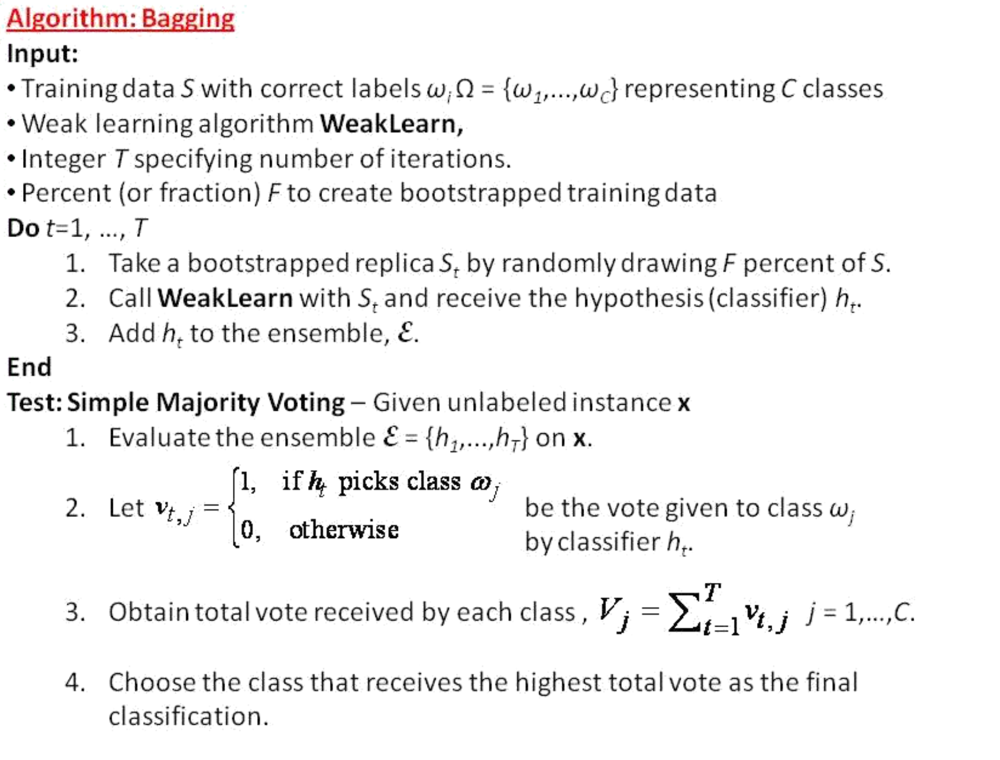

# 第六次实验报告

**李瀚笙 1338875**      

[TOC]

## 实验目标

​		本实验以 Amazon 现实场景中的评论为数据，设计集成学习算法预测评论质量。

​		本实验报告中所有代码均为示例代码，为了叙述清晰，部分是从函数、类中粘贴出来，不保证单独可以正确执行。作者所使用的环境是 MacOS 12.2.1，Python 3.9，PyCharm 2021.3.1，能正确运行各脚本。


## 数据处理

### 分词

​		采用实验五讲解中的分词方法。

```python
def word_tokenizer(string):  # 一般文本列分词
    words = nltk.tokenize.word_tokenize(string)  # 先切词
    # stemmer = nltk.stem.SnowballStemmer('english') # 使用nltk词干化工具
    # words = [stemmer.stem(w) for w in words] # 对每个词词干化
    lemma = nltk.wordnet.WordNetLemmatizer()
    words = [lemma.lemmatize(w).lower() for w in words]
    stopwords = nltk.corpus.stopwords.words('english')  # 使用nltk的停用词
    words = [w for w in words if w not in stopwords]  # 去除停用词
    return words

docs = train_df["reviewText"].tolist()  # 取出所有文本字符串
docy = test_df["reviewText"].tolist()
vectorizer = TfidfVectorizer(tokenizer=word_tokenizer)
train_x = vectorizer.fit_transform(docs)  # 文本向量
train_x = hstack((train_x, train_df[["reviewerID", "asin", "overall"]])).tocsr()  # 加入其他特征
# 测试特征使用训练集上生成的语料库，这样类似真实环境，而且训练集没有出现的词对测试集也没有帮助
test_x = vectorizer.transform(docy)  
# 加入其他特征
test_x = hstack((test_x, test_df[["reviewerID", "asin", "overall"]])).tocsr()  
```

分词的过程是比较耗时的，因此将分词结果储存以供后续使用：

```python
np.savez("train_x.npz", data=train_x.data, indices=train_x.indices,
         indptr=train_x.indptr, shape=train_x.shape)
np.savez("test_x.npz", data=test_x.data, indices=test_x.indices,
         indptr=test_x.indptr, shape=test_x.shape)
```

### 标签的使用

​		对于标签数据，鉴于作业要求对某条评论 “可信的概率” 作出估计，我考虑以 `votes_up/votes_all` 作为标签使用，即取

```python
train_y = train_df["votes_up"] / train_df["votes_all"]
```

在训练的时候，生成以下二元标签供单个分类器使用：

```python
[1 if y >= 0.9 else 0 for y in train_y]
```

在评估的时候，把多个分类器视作投票的用户，以它们分类 1 的比例作为可信概率与标签进行比较。

### 数据降维

​		对数据使用 `TruncatedSVD` 进行降维，代码如下：

```python
pca = TruncatedSVD(n_components=n)
train_x = pca.fit_transform(train_x)
test_x = pca.transform(test_x)
```


## Bagging 算法的实现

### 代码框架

​		将 Bagging 算法的框架兑现为代码即可。



```python
class Bagging:

    def __init__(self, base_algorithm, iterations, bootstrap_fraction):
        self.classifier = base_algorithm  # Class Name
        self.T = iterations
        self.F = bootstrap_fraction
        self.ensemble = []

    def fit(self, sample, label, **kwargs):
        for i in range(self.T):
            # bootstrap
            sample_i = []
            label_i = []
            for j in range(int(len(label) * self.F + 0.5)):
                id = int(random() * len(label)) - 1
                sample_i.append(sample[id])
                label_i.append(label[id])
            # train classifier
            new_classifier = self.classifier(**kwargs)
            new_classifier.fit(sample_i, label_i)
            # add classifier to ensemble
            self.ensemble.append(new_classifier)

    def predict(self, instance):
        # evaluate ensemble on instance
        res = []
        for classifier in self.ensemble:
            res.append(classifier.predict(instance))
        # obtain total vote of each class
        return np.mean(res)  # as probability of being helpful
        # output 1 == the model "votes up"
        # output 0 == the model "votes down"
        # sklearn 有个 predict_prob 函数也许可以用？

```

值得一提的是，这个代码不能处理分词结果输出的 `csr_matrix`，因为即使使用 `.getrow()` 方法选出各行，在训练过程中依然有各种问题出现。我使用的解决方法是要么先降维处理，要么传入 `.A` （大概需要 200G 运行内存完成一次训练），总之算法只处理 `ndarray`。

​		通过与 `sklearn.ensemble.BaggingClassifier` 的使用对比，除了运行速度约慢 25% 之外，二者的效果相近。

### 误差分析

​		分别采用 AUC 和 squared error 度量准确率，代码如下：

```python
bagging = Bagging(...)
bagging.fit(...)
results = {}
y_predict = [bagging.predict(sample.reshape(1, -1)) for sample in x_test]
auc = roc_auc_score([1 if y >= 0.9 else 0 for y in y_test], 
                    [1 if y >= 0.9 else 0 for y in y_predict])
err = [(pred - test) ** 2 for pred, test in zip(y_predict, y_test)]
res[i] = {bagging_svm, auc, sum(err)/len(y_test)}
```

生成提交比赛的 csv 文件代码如下：

```python
bagging = Bagging(...)
bagging.fit(train_x.A, [1 if y >= 0.9 else 0 for y in train_y])

f = open('result.csv', mode='wt')
f.write('Id,Predicted\n')
for index, term in enumerate(test_x.A):
    result = bagging_svm.predict(term.reshape(1, -1))
    f.write("%d,%.2f\n" % (index, result))
f.close()
```


### 并行加速

​		运行过程需要运行多次数据相互独立的模型训练，是否可以通过并行加速？但是 sklearn 的 `SVC` 算法没有 `n_jobs=` 参数，只能通过并行化循环实现。通过学习示例代码，我改写了上述类：

```python
class BaggingMul(Bagging):

    def fit(self, sample, label, **kwargs):

        num_cores = multiprocessing.cpu_count()
        self.ensemble = Parallel(n_jobs=num_cores)\
            (delayed(bootstrap)(sample, label, self.classifier, 
                                self.F, **kwargs) for i in range(self.T))


def bootstrap(sample, label, classifier, F, **kwargs):
    # bootstrap
    sample_i = []
    label_i = []
    for j in range(int(len(label) * F + 0.5)):  # 不可以用 sample 的 len
        id = int(random() * len(label)) - 1
        sample_i.append(sample[id])
        label_i.append(label[id])
    # train classifier
    new_classifier = classifier(**kwargs)
    new_classifier.fit(sample_i, label_i)
    # add classifier to ensemble
    return new_classifier
```

将 `bootstrap` 放在全局位置是为了使它可以 `pickle` 化；但是运行时仍然报错

```pythonTraceback
_pickle.PicklingError: Could not pickle
```

通过查询资料，似乎是因为 `bootstrap` 中使用的 `classifier.__init__` 和 `fit` 不可以 `pickle` 化。鉴于 `sklearn` 中的 `BaggingClassifier` 也不支持并行，只能对支持并行的单个算法并行训练，这个优化能否实现还是一个问题。而跑基于 `Decision_Tree` 的模型时 CPU 自然就能跑满，不需要特地进行优化。

### Bagging + SVM

​		有以下四个候选 SVM 算法：`LinearSVC`，`SVC`，`LinearSVR`，`SVR`。前两个是基于 SVM 的分类器，后两个是基于 SVM 的回归器。`Linear...` 版本相当于通用版本指定线性 kernel 的情况，但是运行速度会快一些。依次尝试以上各种方法。划分训练集和验证集如下：

```python
RANDOM_SEED = 0xa192c122
x_train, x_test, y_train, y_test = train_test_split(train_x, train_y, test_size=0.2, random_state=RANDOM_SEED)
```

- `LinearSVC`。使用该 kernel，每次迭代都会报警告：

  ```pythonTraceback
  ConvergenceWarning: Liblinear failed to converge, increase the number of iterations.
  ```

  这说明线性 kernel 不够好。

  （0）基准：

  - sklearn 的 `BaggingClassifier` 以默认参数分类后测试集 AUC 为 0.5。
  - 直接使用 LinearSVC 得到测试集 AUC 为 0.51259，降维至 20 后为 0.46501。 

  （1）先讨论降维的影响。

  - 不降维：运行时间非常长，选取 T=50，测试集 AUC 为 0.497。
  - 降维至 20：运行时间比较短，选取 T=50，测试集 AUC 为 0.49632。

  可以看到降维对 AUC 的影响不大，因此采用降维后的样本数据调参，这样会快一点得到结果。

  （2）讨论 T 的影响。

  ```python
  pca = TruncatedSVD(n_components=20)
  train_x = pca.fit_transform(train_x)
  test_x = pca.transform(test_x)
  res = {}
  
  for i in range(10, 50, 5):
      print("running k = %d" % i)
      bagging_svm = Bagging(LinearSVC, i, 1)
      bagging_svm.fit(x_train, [1 if y >= 0.9 else 0 for y in y_train])
      results = {}
      y_predict = [bagging_svm.predict(test.reshape(1, -1)) for test in x_test]
      auc = roc_auc_score([1 if y >= 0.9 else 0 for y in y_test], 
                          [1 if y >= 0.9 else 0 for y in y_predict])
      err = [(pred - test) ** 2 for pred, test in zip(y_predict, y_test)]
      res[i] = {auc, sum(err)/len(y_test)}
  ```

  得到的结果如下：

  ```
  {
  		10: {0.5, 0.2710026340740096}, 
  		15: {0.5, 0.2518407805933097}, 
  		20: {0.5, 0.2631460849582418}, 
  		25: {0.5, 0.17070766105230506}, 
  		30: {0.5, 0.18214402200417837}, 
  		35: {0.5, 0.2689292326866453}, 
  		40: {0.5, 0.19074230169820017}, 
  		45: {0.5, 0.20343961778124936}
  }
  ```

  可以看到在 T=25-30 左右有最低的均方误差，但是 AUC 都是 0.5。分别以 T=20, 25, 30, 35 计算并提交，得到测试集上 AUC 如下：

  ```
  {
  		20: 0.51945
  		25: 0.50108
  		30: 0.46637
  		35: 0.47589
  }
  ```

  那考虑到随机因素，还是选择 T=25 比较合适。

  （3）讨论 F 的影响。

  ```python
  for f in range(5, 15, 1):
      bagging_svm = Bagging(LinearSVC, 25, f/10)
      ...
      res[f/10] = (auc, sum(err)/len(y_test))
  ```

  结果如下：

  ```
  {
  		0.5: (0.5, 0.25299867744504817), 
  		0.6: (0.5, 0.22400908211866713), 
  		0.7: (0.5, 0.2512126580261963), 
  		0.8: (0.5, 0.23288022489609864), 
  		0.9: (0.5, 0.30738046162947713), 
  		1.0: (0.5, 0.16901359941199012), 
  		1.1: (0.5, 0.1661272800508572), 
  		1.2: (0.5, 0.32184415846619335), 
  		1.3: (0.5, 0.16232005562577936), 
  		1.4: (0.5, 0.27464585787446916)
  }
  ```

  从结果可以看出选择 F=1 即可。

  （4）讨论 SVC 参数 C 的影响。

  ```python
  for c in range(2, 20, 1):
      bagging_svm = Bagging(LinearSVC, 25, 1)
      bagging_svm.fit(x_train, 
                      [1 if y >= 0.9 else 0 for y in y_train], 
                      C=c/10)
      ...
      res[c/10] = (auc, sum(err)/len(y_test))
  ```

  结果如下：

  ```
  {
  		0.2: (0.5, 0.2624791284236905), 
  		0.3: (0.5, 0.23319560905578776), 
  		0.4: (0.5, 0.25676870390099277), 
  		0.5: (0.5, 0.19560150748196858), 
  		0.6: (0.5, 0.19220791246582988), 
  		0.7: (0.5, 0.21228180543246514), 
  		0.8: (0.5, 0.2558191918191605), 
  		0.9: (0.5, 0.22881670286364053), 
  		1.0: (0.5, 0.2879784973526365), 
  		1.1: (0.5, 0.2020692339995148), 
  		1.2: (0.5, 0.1937371031232165), 
  		1.3: (0.5, 0.22339350760440546), 
  		1.4: (0.5, 0.18045171576669025), 
  		1.5: (0.5, 0.21743632141695027), 
  		1.6: (0.5, 0.17338010445051866), 
  		1.7: (0.5, 0.22892434173756016),
      1.8: (0.5, 0.19030924611662695), 
      1.9: (0.5, 0.1885123748725587)
  }
  ```

  考虑到原本 1.0 的结果比较大，以此估算随机因素影响导致的变动范围，不同的 C 值没有显著的改变，对 C=0.5 和 C=1.5 计算并提交得到 AUC 如下：

  ```
  {
  		0.5: 0.45152
  		1.5: 0.53185
  }
  ```

  似乎更大的 C 值结果更佳。看到 1.9 附近均方误差又降低了，继续尝试更高的 C 值：

  ```
  {
  		2.0: 0.53808
  		2.5: 0.46572
  }
  ```

  因此还是选 C=2.0 比较合适。

- `SVC`。主要考虑使用 Gaussian 核。因为它等效于升维，这个核没法稀疏矩阵使用，要用必须先降维。并且即使降维至 10 维，运行时间仍然长的难以接受，对它的调参讨论就主要集中在基分类器个数 T 上。结果如下：

  ```
  {
  		10: (0.5, 0.49228336608415785),
  		15: (0.5, 0.49228336608415785),
  		20: (0.5, 0.49228336608415785),
  		25: (0.5, 0.49228336608415785)
  }
  ```

  可以看出虽然运算时间显著加长，但是准确率没有显著变化。奇怪的是，这个结果似乎失去了随机性：不论使用几次都是一模一样的数字。

- `LinearSVR`。这个模型可以不用把 vote_up 的比例调整成 0-1 的 label。

  （1）讨论 T 值的影响。

  ```python
  for k in range(5, 31, 5):
      bagging_svm = Bagging(LinearSVR, k, 1)
      bagging_svm.fit(x_train, y_train.to_numpy(), C=1.5)
  
      y_predict = [bagging_svm.predict(test_sample.reshape(1, -1)) for test_sample in x_test]
      auc = roc_auc_score([1 if y >= 0.9 else 0 for y in y_test], [1 if y >= 0.9 else 0 for y in y_predict])
      err = [(pred - test) ** 2 for pred, test in zip(y_predict, y_test)]
      print('k=', k, ': auc=', auc, ', err=', sum(err)/len(y_test))
  ```

  得到结果如下：

  ```
  {
  		 5: (0.625933889716647, 0.09137185040673883),
  		10: (0.5371890415642789, 0.11506828137127474),
  		15: (0.5287612951114661, 0.1151155917019429),
  		20: (0.5455109431790024, 0.0728010014652953),
  		25: (0.5818876348082577, 0.07746103805359553),
  		30: (0.5257648539304445, 0.07320124685431421)
  }
  ```

  可以看到就相比 SVC 的情况，SVR 的准确度高很多。且 err 和 AUC 的变化趋势并不一致。最优的似乎是 5。测试集回报的 AUC 如下：

  ```
  {
  		 5: 0.56579,
  		10: 0.54927,
  		15: 0.53528,
  		20: 0.51654,
  		25: 0.48048
  }
  ```

  此外，LinearSVR 可能出现取值不在 0-1 之间的情况，需要予以约束。

  （2）讨论维度的影响。取 T=5。

  - 不降维：测试集回报 AUC 为 0.59524。

  - 降维至 20：测试集回报 AUC 为 0.56579。

  - 在其间随机选择几个维度值进行测试：

    ```python
    for n in [50, 100, 500, 1000, 10000, 50000, 100000]:
        pca = TruncatedSVD(n_components=n)
        ...
    ```

    得到验证集上结果如下：

    ```
    {
    		    50: (0.5964112735248323, 0.07706760199541933),
    		   100: (0.598365172265666, 0.10483597311412463),
    		   500: (0.6617466454154642, 0.18450958103968662), 
    		  1000: (0.5007023933571598, 0.22543262855651072)
    }
    ```

    更大的维度会因为内存占用过大被系统杀死。取 n=500 时测试数据集汇报的 AUC 为 0.64219。

- `SVR` 因时间原因不再进行测试。

### Bagging + DecisionTree

​		做了半天离散化才发现 sklearn 的 DecisionTree 不需要离散化。。。。因此可以直接沿用之前的代码。

```python
for i in range(10, 50, 5):
    print("running k = %d" % i)
    bagging_svm = Bagging(DecisionTreeClassifier, i, 1)
    bagging_svm.fit(x_train, np.array([1 if y >= 0.9 else 0 for y in y_train]))
    results = {}
    y_predict = [bagging_svm.predict(test.reshape(1, -1)) for test in x_test]
    auc = roc_auc_score([1 if y >= 0.9 else 0 for y in y_test],
                        [1 if y >= 0.9 else 0 for y in y_predict])
    err = [(pred - test) ** 2 for pred, test in zip(y_predict, y_test)]
    print("k=%d, auc=%f, err=%f" % (i, auc, sum(err)/len(y_test)))
```

输出为

```python
running k = 10
k=10, auc=0.506248, err=0.232947
running k = 15
k=15, auc=0.501842, err=0.226772
running k = 20
k=20, auc=0.502545, err=0.225503
running k = 25
k=25, auc=0.502222, err=0.223254
running k = 30
k=30, auc=0.502981, err=0.221488
running k = 35
k=35, auc=0.501215, err=0.222362
running k = 40
k=40, auc=0.501595, err=0.221613
running k = 45
k=45, auc=0.501082, err=0.220823
```

这个结果很奇怪，特别是对于后面几种情况在验证集上的表现都不如 SVM，但是测试集的情况则反之。而且不同的参数在验证集的表现差别不大，不知道其中原因。重新指定随机种子依然如是。鉴于此，本节之后各项验证都去测试集上验证。

​		考虑到决策树并不擅长利用很分散的信息，将降维的维度进一步减少。取 n=20，k=10 得到测试集上 AUC 为 0.72247，取 k=20 得到测试集上 AUC 为 0.74505，取 k=40 得到测试集上 AUC 为 0.75083，取 k=80 得到测试集上 AUC 为 0.76548，取 k=160 得到测试集上 AUC 为 0.77031，


## AdaBoost.M1 算法的实现

### 代码框架

​		将 `AdaBoost.M1` 算法的框架兑现为代码即可。

```python
class M1:

    def __init__(self, base_algorithm, iterations):
        self.classifier = base_algorithm
        self.T = iterations
        self.ensemble = []
        self._weights = []

    def fit(self, sample, label, **kwargs):
        s_weights = [1/sample.shape[0]] * sample.shape[0]  # 初始平均权重
        for t in range(self.T):
            # Train a new learner
            classifier_i = self.classifier(**kwargs)
            classifier_i.fit(sample, label, sample_weight=s_weights)
            # Measure the Error
            pred = classifier_i.predict(sample)
            error = 0
            for wgt, lbl, pbl in zip(s_weights, label, pred):
                if (lbl - 0.9) * (pbl - 0.9) < 0:  # (1)
                    error += wgt
            if error > 0.5:
                raise RuntimeError("Choose a better classifier!")
            # Calculate classifier weight
            beta = error/(1-error)
            self.ensemble.append(classifier_i)
            self._weights.append(beta)
            # Update sample weight
            new_s_weight = []
            for wgt, lbl, pbl in zip(s_weights, label, pred):
                if (lbl - 0.9) * (pbl - 0.9) > 0:  # (2)
                    new_s_weight.append(wgt * beta)
                else:
                    new_s_weight.append(wgt)
            # Normalization
            sum_norm = sum(new_s_weight)
            s_weights = [wgt/sum_norm for wgt in new_s_weight]

  def predict(self, sample):
      # 加权均值
      pred = 0
      for cls, wgt in zip(self.ensemble, self._weights):
      		pred += cls.predict(sample) * log(1/wgt)
      return pred
```

其中 (1) 与 (2) 处的判断条件是为了防止使用 `LinearSVR` 的过程中遇到问题。

### 误差分析

​		因为上述 `AdaBoost.M1` 接口设计与 `Bagging` 算法一致，因此可使用同一套框架进行训练和测试。

### AdaBoost.M1 + SVM

- `LinearSVC` 无法完成执行，会在至多第四次因错误率太高退出。用退出时后台的分类器在 console 中评估预测值，得到 auc 为 0.48853229284676297，squared error 为 0.44572163，均比较差。

-  `LinearSVR` 通常能执行 3-5 轮，选取某次运气好执行完 5 轮的分类器，其在验证集上平均的 AUC 为 0.60591043，在测试集上报告的 AUC 为 0.69031。

- 根据 Bagging 使用过程中发现的规律，两个很慢的分类器只尝试 `SVR` 一个。

  更新：前期拖延太久了。。。这里只跑一个 T=5 的都没能跑完。。。

### AdaBoost.M1 + DecisionTree

​		替换下传给 `AdaBoost.M1` 的分类器，即得到配合 DecisionTree 的版本。

​		执行后出现 `ZeroDivisionError`，原因是验证集上所有分类都正确，因此新的权重都是 0，导致正则化过程中出错。既然出现这个情况，有理由相信各项参数比较合适。

​		为了避免出现 NaN，给决策树传入最大深度 10，即可正常运行。但是分类结果大部分是 1，测试 AUC 结果为 0.5007。

## 总结讨论

- DecisionTree 算法的表现明显优于 SVM 算法。
- 感觉 AdaBoost.M1 算法的实现还存在潜在的 bug，按照直觉来说它的效果应该比 Bagging 好。
- 一定不能在做实验前期钻研些不太重要的问题，比如并行计算，研究好久研究不出来，后面就没时间做了🤦‍♂️


